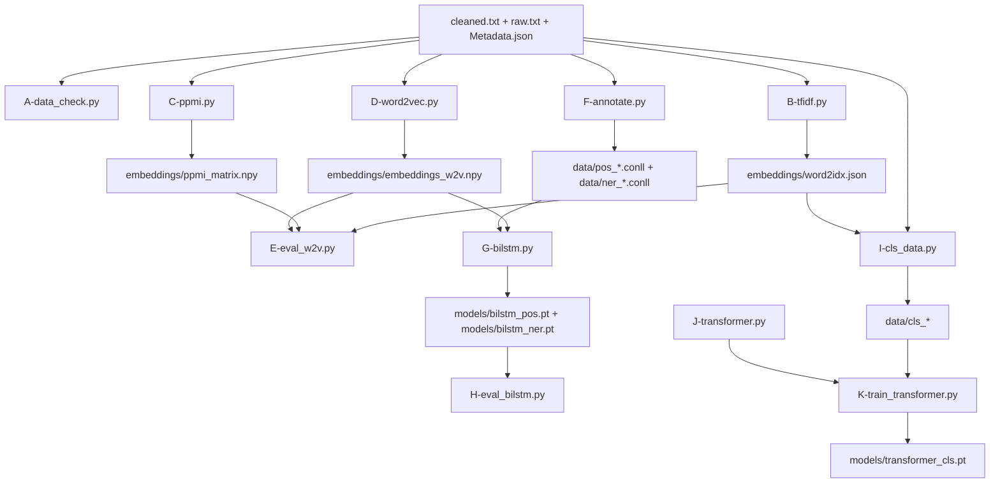
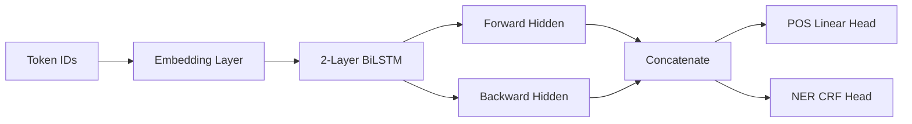
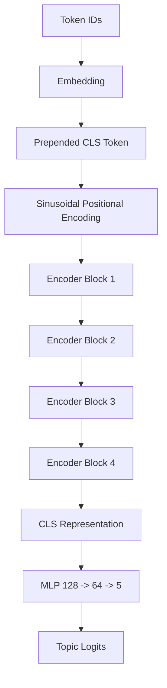
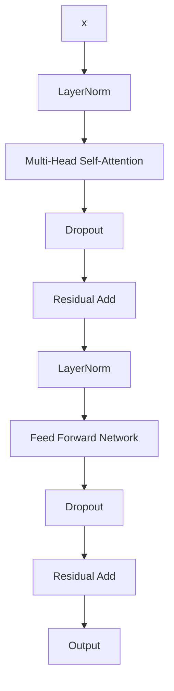

# i23-2578 NLP Assignment 2

BBC Urdu Neural NLP Pipeline implemented in PyTorch from scratch for CS-4063 Natural Language Processing.

## Overview

This repository contains a full end-to-end Urdu NLP pipeline split into three major parts:

1. Word representation learning
2. Sequence labeling with BiLSTM models
3. Topic classification with a Transformer encoder

The codebase was developed as a sequence of small commits, and each major task remains available as a standalone script. The notebook [i23_2578.ipynb](C:/Users/Administrator/OneDrive/Desktop/Semester#6/NLP/Assignments/i23-2578_Assignment2_DS-A/i23_2578.ipynb) ties the whole workflow together in one executable document.

## Core Restrictions Followed

- PyTorch only
- No pretrained models
- No Gensim
- No HuggingFace
- No `nn.Transformer`
- No `nn.MultiheadAttention`
- No `nn.TransformerEncoder`
- Transformer attention, FFN, positional encoding, and encoder blocks implemented manually

## Repository Structure

```text
.
├── A-data_check.py
├── B-tfidf.py
├── C-ppmi.py
├── D-word2vec.py
├── E-eval_w2v.py
├── F-annotate.py
├── G-bilstm.py
├── H-eval_bilstm.py
├── I-cls_data.py
├── J-transformer.py
├── K-train_transformer.py
├── i23_2578.ipynb
├── cleaned.txt
├── raw.txt
├── Metadata.json
├── embeddings/
├── data/
└── models/
```

## Pipeline Flow



## Part-Wise Summary

### Part 1: Word Embeddings

- `A-data_check.py`
  Reads `cleaned.txt` and prints token count, vocabulary size, and document count.
- `B-tfidf.py`
  Builds a TF-IDF term-document matrix using the top 10,000 tokens plus `<UNK>`.
- `C-ppmi.py`
  Builds a word-word co-occurrence matrix with window size 5, computes PPMI, saves a t-SNE visualization, and exports nearest-neighbour outputs.
- `D-word2vec.py`
  Trains a skip-gram Word2Vec model with negative sampling.
- `E-eval_w2v.py`
  Evaluates nearest neighbours, analogies, and 4 embedding conditions with MRR comparison.

### Part 2: POS and NER

- `F-annotate.py`
  Samples 500 sentences, assigns heuristic topic labels, creates rule-based POS tags and gazetteer-based NER tags, and writes CoNLL files.
- `G-bilstm.py`
  Trains a 2-layer BiLSTM for POS and a 2-layer BiLSTM-CRF for NER with frozen and fine-tuned embeddings.
- `H-eval_bilstm.py`
  Produces POS metrics, confusion matrix, NER entity metrics, CRF vs softmax comparison, and ablation results.

### Part 3: Topic Classification

- `I-cls_data.py`
  Assigns 5 topic labels using keyword rules, encodes articles as token ID sequences of length 256, and saves stratified splits.
- `J-transformer.py`
  Implements scaled dot-product attention, multi-head attention, FFN, sinusoidal positional encoding, pre-LN encoder blocks, and a CLS-based classifier from scratch.
- `K-train_transformer.py`
  Trains the transformer classifier with AdamW and cosine scheduling, evaluates it, saves plots, confusion matrix, heatmaps, and checkpoint.

## Mermaid Architecture Diagrams

### BiLSTM Sequence Labeling



### Transformer Encoder Classifier



### Encoder Block Details



## Environment Setup

Create and activate a virtual environment, then install the required packages:

```powershell
python -m venv .venv
.venv\Scripts\activate
pip install -r requirements.txt
```

## Full Reproduction Order

Run the scripts in this order:

```powershell
python A-data_check.py
python B-tfidf.py
python C-ppmi.py
python D-word2vec.py
python E-eval_w2v.py
python F-annotate.py
python G-bilstm.py
python H-eval_bilstm.py
python I-cls_data.py
python J-transformer.py
python K-train_transformer.py
```

## Notebook Execution

Open [i23_2578.ipynb](C:/Users/Administrator/OneDrive/Desktop/Semester#6/NLP/Assignments/i23-2578_Assignment2_DS-A/i23_2578.ipynb) and run all cells from top to bottom.

The notebook includes:

- data verification
- TF-IDF generation
- PPMI generation and t-SNE
- Word2Vec training and evaluation
- POS and NER annotation
- BiLSTM training and evaluation
- topic classification dataset creation
- transformer smoke test and training
- final model comparison write-up
- final required-file checklist

## Required Input Files

- `cleaned.txt`
- `raw.txt`
- `Metadata.json`

## Main Output Files

### Embeddings

- `embeddings/tfidf_matrix.npy`
- `embeddings/ppmi_matrix.npy`
- `embeddings/embeddings_w2v.npy`
- `embeddings/word2idx.json`
- `embeddings/ppmi_tsne.png`
- `embeddings/ppmi_tsne_clean.png`
- `embeddings/ppmi_tsne_coords.csv`
- `embeddings/ppmi_neighbours.txt`

### Sequence Labeling Data

- `data/pos_train.conll`
- `data/pos_val.conll`
- `data/pos_test.conll`
- `data/ner_train.conll`
- `data/ner_val.conll`
- `data/ner_test.conll`

### Topic Classification Data

- `data/cls_train_x.npy`
- `data/cls_train_y.npy`
- `data/cls_train_id.npy`
- `data/cls_val_x.npy`
- `data/cls_val_y.npy`
- `data/cls_val_id.npy`
- `data/cls_test_x.npy`
- `data/cls_test_y.npy`
- `data/cls_test_id.npy`

### Models and Figures

- `models/bilstm_pos.pt`
- `models/bilstm_ner.pt`
- `models/pos_loss_curve.png`
- `models/ner_loss_curve.png`
- `models/pos_confusion_matrix.png`
- `models/transformer_cls.pt`
- `models/transformer_loss.png`
- `models/transformer_acc.png`
- `models/transformer_confusion_matrix.png`
- `models/transformer_heatmap_1.png`
- `models/transformer_heatmap_2.png`
- `models/transformer_heatmap_3.png`

## Final Checklist

- `embeddings/tfidf_matrix.npy` exists
- `embeddings/ppmi_matrix.npy` exists
- `embeddings/embeddings_w2v.npy` exists
- `embeddings/word2idx.json` exists
- `models/bilstm_pos.pt` exists
- `models/bilstm_ner.pt` exists
- `models/transformer_cls.pt` exists
- `data/pos_train.conll` exists
- `data/pos_test.conll` exists
- `data/ner_train.conll` exists
- `data/ner_test.conll` exists
- notebook file exists
- transformer plots and heatmaps exist

## Known Notes

- `Metadata.json` in this repository does not contain usable topic categories, so topic-sensitive steps use keyword-based heuristics.
- The POS tag inventory produced by the current annotation pipeline includes 11 active labels because the heuristic tagger did not generate one of the intended classes on the sampled set.
- NER quality is limited by weak supervision and gazetteer coverage, but the full BiLSTM-CRF pipeline, comparison, and ablations are implemented.
- The transformer heatmaps are saved with a Unicode-capable plotting font path to improve Urdu token rendering.

## Suggested Submission Bundle

For final submission, keep these top-level files ready:

- `i23_2578.ipynb`
- `report.pdf`
- `README.md`
- all generated `data/`, `embeddings/`, and `models/` artifacts

## Quick Validation Commands

```powershell
python A-data_check.py
python E-eval_w2v.py
python H-eval_bilstm.py
python K-train_transformer.py
```

## Author

- Roll number: `i23-2578`
- Course: `CS-4063 Natural Language Processing`
- Institution: `FAST NUCES`
